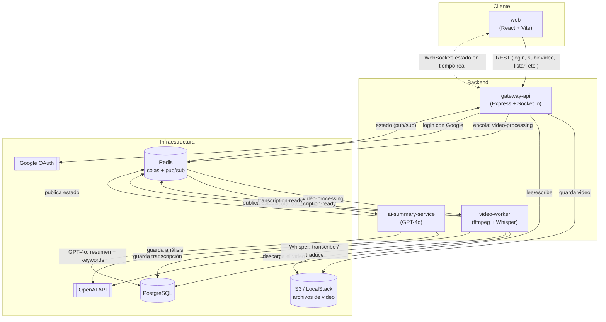

# TranscribeMind

Sube un video (archivo, enlace directo o YouTube) y obtén automáticamente su **transcripción**, un **resumen ejecutivo** y **puntos clave** generados con IA, en el idioma que elijas (español, inglés o alemán).


## Índice

- [¿Qué hace?](#qué-hace)
- [Arquitectura](#arquitectura)
- [Servicios](#servicios)
- [Cómo correrlo](#cómo-correrlo)
- [Variables de entorno principales](#variables-de-entorno-principales)
- [Funcionalidades](#funcionalidades)
- [Scripts útiles](#scripts-útiles)

## ¿Qué hace?

1. Subes un video (arrastrando un archivo, pegando un enlace, o un link de YouTube).
2. El sistema extrae el audio y lo transcribe con **Whisper** (OpenAI).
3. Si el idioma hablado no coincide con el que elegiste, la transcripción se traduce automáticamente.
4. **GPT-4o** genera un resumen ejecutivo, puntos clave y keywords a partir de la transcripción, en el idioma seleccionado.
5. Puedes ver el resultado en el dashboard, editar el título, exportarlo a `.txt`/`.pdf`, o eliminarlo.

Todo el proceso es asíncrono: subes el video, sigues usando la app, y el estado se actualiza en tiempo real (en cola → procesando audio → transcribiendo → generando IA → completado).

## Arquitectura

Es un monorepo con 3 servicios backend independientes que se comunican por colas (Redis/BullMQ), más un frontend que habla con la API por HTTP y WebSockets.



**Por qué tres servicios separados:** así cada etapa pesada (descargar/transcodificar, transcribir, resumir) escala de forma independiente y un fallo en una no bloquea a las demás. Si `ai-summary-service` está caído, los videos igual se transcriben; solo se quedan esperando el resumen.

## Servicios

| Servicio | Carpeta | Qué hace |
|---|---|---|
| **web** | `apps/web` | Frontend en React + Vite + TailwindCSS. Login, dashboard, subida de videos, resultados. |
| **gateway-api** | `apps/gateway-api` | API REST + WebSocket. Autenticación (email/contraseña y Google), maneja la subida de videos (archivo, URL, YouTube vía `yt-dlp`), expone el estado en tiempo real. |
| **video-worker** | `apps/video-worker` | Descarga el video de S3, extrae el audio con `ffmpeg`, lo transcribe con Whisper y traduce si hace falta. |
| **ai-summary-service** | `apps/ai-summary-service` | Toma la transcripción y genera el resumen ejecutivo, puntos clave y keywords con GPT-4o. |

### Paquetes compartidos (`packages/`)

| Paquete | Para qué |
|---|---|
| `contracts` | Tipos y esquemas compartidos entre todos los servicios: estados de video, idiomas soportados, payloads de las colas, eventos de WebSocket. |
| `database` | Cliente de Prisma + el esquema de la base de datos (una sola base, compartida por los 3 servicios backend). |
| `config` | Helper para validar variables de entorno con Zod. |
| `logger` | Logger compartido (pino). |

## Cómo correrlo

Hay dos formas de levantar el proyecto: **modo desarrollo** (corres el código directamente con Node, con hot-reload) o **todo en Docker** (un solo comando, sin instalar nada más que Docker).

### Requisitos comunes
- Una API key de OpenAI
- (Opcional) un Client ID de Google OAuth, si quieres habilitar "Continuar con Google"

### Configurar las variables de entorno (una sola vez)

```bash
cp .env.example .env
cp apps/web/.env.example apps/web/.env
# edita .env: pon tu OPENAI_API_KEY (y GOOGLE_CLIENT_ID si lo usas)
```

---

### Opción A — Modo desarrollo (hot-reload, corre en tu máquina)

Requisitos: Node.js 20+ y Docker (solo para la infraestructura: Postgres, Redis, LocalStack).

```bash
# 1. Instala dependencias de todo el monorepo
npm install

# 2. Levanta Postgres, Redis y LocalStack (S3) en contenedores
docker compose up -d postgres redis localstack

# 3. Aplica las migraciones de la base de datos
npm run db:migrate

# 4. Arranca todo (web + los 3 servicios backend) con hot-reload
npm run dev
```

Esto deja:
- **web** en `http://localhost:5173` (Vite, recarga al guardar cambios)
- **gateway-api** en `http://localhost:3000`
- `video-worker` y `ai-summary-service` corriendo en segundo plano, escuchando trabajos en la cola.

Para detener todo: `Ctrl+C` en la terminal de `npm run dev`, y `docker compose down` si quieres apagar también la infraestructura.

---

### Opción B — Todo en Docker (un solo comando, sin Node instalado)

Requisitos: solo Docker.

```bash
docker compose up --build -d
```

Esto construye y levanta **los 7 contenedores** (Postgres, Redis, LocalStack, `gateway-api`, `video-worker`, `ai-summary-service` y `web`), aplica las migraciones de base de datos automáticamente al arrancar `gateway-api`, y deja todo listo en:

- **web** en `http://localhost:5173`
- **gateway-api** en `http://localhost:3000`

No hace falta correr `npm install` ni `npm run db:migrate` a mano — todo pasa dentro de los contenedores.

Comandos útiles:

```bash
docker compose logs -f              # ver logs de todos los servicios
docker compose logs -f gateway-api  # ver logs de uno en particular
docker compose ps                   # ver el estado de cada contenedor
docker compose down                 # apagar todo (los datos de Postgres se conservan en un volumen)
docker compose up --build -d        # reconstruir y reiniciar después de un cambio de código
```

> Nota: la primera vez que se reconstruye `gateway-api`, descarga el binario de `yt-dlp` (para soportar links de YouTube) directamente desde GitHub — si esa descarga falla por una caída temporal de red, basta con repetir `docker compose up --build -d`.

## Variables de entorno principales

Ver `.env.example` (raíz) y `apps/web/.env.example` para la lista completa. Las más importantes:

- `DATABASE_URL`, `REDIS_URL` — conexión a Postgres y Redis.
- `S3_*` — credenciales y endpoint del almacenamiento de objetos (LocalStack en desarrollo).
- `OPENAI_API_KEY` — usada por `video-worker` (Whisper) y `ai-summary-service` (GPT-4o).
- `JWT_SECRET` — firma de sesión.
- `GOOGLE_CLIENT_ID` — opcional, habilita "Continuar con Google" (backend y `VITE_GOOGLE_CLIENT_ID` en el frontend).
- `COOKIE_SECURE` — déjalo en `false` salvo que sirvas la app por HTTPS real; si lo pones en `true` sobre HTTP plano, el navegador descarta la cookie de sesión y el login deja de funcionar.

## Funcionalidades

- Registro/login con email + contraseña (con nombre de usuario) o con Google.
- Subida de video por archivo, URL directa, o link de YouTube (vía `yt-dlp`).
- Selección de idioma del resultado (español por defecto, inglés o alemán) — aplica tanto a la transcripción como al resumen de IA.
- Estado del procesamiento en tiempo real (WebSocket).
- Edición del título del video.
- Eliminar un video (borra también su archivo y todo su contenido asociado).
- Exportar resultado a `.txt` o `.pdf`.
- Reintentar el procesamiento si un video falló.
- Interfaz responsive, con menú lateral colapsable (hamburguesa) en pantallas de celular.
- Instalable como **PWA** (ícono de inicio, modo standalone, funciona offline para la parte de la interfaz ya cacheada — no para subir/procesar videos, que siempre requiere conexión).

## Scripts útiles

```bash
npm run build       # build de todos los paquetes/servicios
npm run typecheck   # chequeo de tipos en todo el monorepo
npm run db:generate # regenerar el cliente de Prisma
npm run db:migrate  # crear/aplicar una migración de base de datos
```
